# Project Management Tool Setup Guide for CleanCity QA Testing

**Note:** Students may use either Jira **or** GitHub Kanban (Projects) for all project management, bug tracking, and reporting requirements. GitHub Kanban is free and integrated with GitHub, making it a convenient alternative to Jira. All instructions below are for Jira, but equivalent steps can be followed in GitHub Kanban.

## 📋 **Document Information**

**Document Version:** 1.0  
**Date:** [Current Date]  
**Project:** CleanCity - Waste Pickup Scheduler  
**Prepared For:** QA Testing Teams  

---

## 🎯 **Jira Overview**

### **What is Jira?**
Jira is a project management tool that helps teams track issues, manage projects, and collaborate effectively. For this QA testing project, Jira will be used to:
- Track all testing activities
- Report and manage bugs
- Monitor project progress
- Generate reports for final submission

### **Why Jira for QA Testing?**
- **Centralized Issue Tracking:** All bugs and tasks in one place
- **Detailed Bug Reports:** Structured format with all necessary information
- **Progress Monitoring:** Real-time visibility into testing progress
- **Team Collaboration:** Assign tasks and share information
- **Reporting:** Generate comprehensive reports for final submission

---

## 🚀 **Step-by-Step Jira Setup**

### **Step 1: Create Jira Account**
1. **Go to Atlassian.com**
   - Visit https://www.atlassian.com
   - Click "Get it free" or "Try free"

2. **Sign Up for Jira Cloud**
   - Click "Start free trial"
   - Enter your email address
   - Create a password
   - Choose "Jira Software" (not Jira Service Management)

3. **Complete Registration**
   - Fill in your name and organization
   - Choose "Software Development" as your use case
   - Click "Create account"

### **Step 2: Create New Project**
1. **Access Jira Dashboard**
   - Log in to your Jira account
   - You'll see the welcome screen

2. **Create Project**
   - Click "Create project"
   - Select "Software development"
   - Choose "Scrum" as the template
   - Click "Next"
   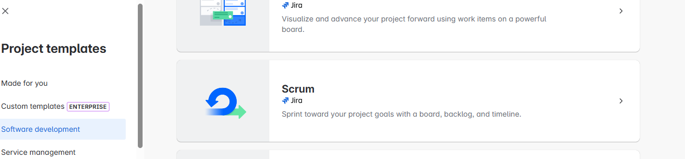

3. **Configure Project**
   - **Project name:** CleanCity QA Testing
   - **Project key:** CLEANCITY
   - **Project lead:** [Your name]
   - Click "Create"
   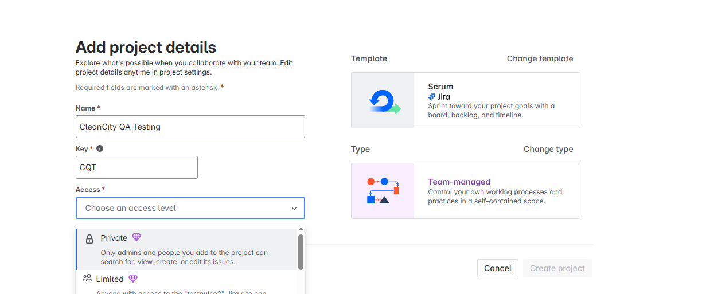

### **Step 3: Configure Issue Types**
1. **Access Project Settings**
   - Go to your project dashboard
   - Click the gear icon (Settings)
   - Select "Issues"
   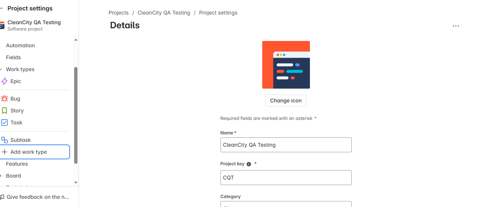

2. **Verify Issue Types**
   - **Epic:** For major testing phases
   - **Story:** For feature testing requirements
   - **Task:** For individual testing activities
   - **Bug:** For defects found during testing

3. **Customize Bug Issue Type**
   - Click on "Bug" issue type
   - Ensure these fields are available:
     - Summary
     - Description
     - Environment
     - Severity
     - Priority
     - Steps to Reproduce
     - Expected vs Actual
     - Attachments
     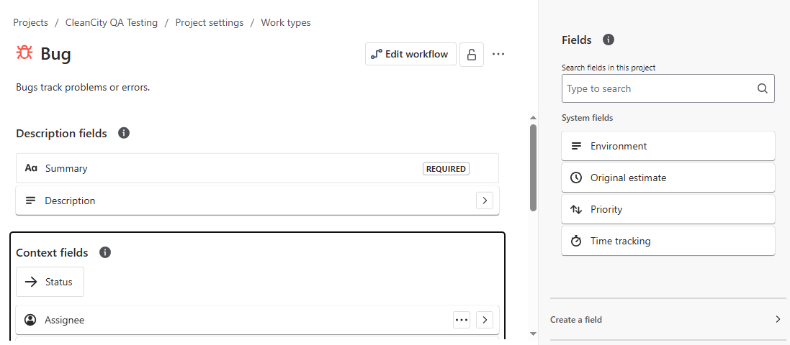

### **Step 4: Create Custom Fields**
1. **Add Environment Field**
   - Go to Settings → Issues → Custom fields
   - Click "Add custom field"
   - Choose "Select list (single choice)"
   - Name: "Environment"
   - Options: Chrome, Firefox, Safari, Edge, Mobile, Tablet

2. **Add Severity Field**
   - Create another custom field
   - Type: "Select list (single choice)"
   - Name: "Severity"
   - Options: Critical, Major, Minor, Cosmetic

3. **Add Steps to Reproduce Field**
   - Create custom field
   - Type: "Text field (multi-line)"
   - Name: "Steps to Reproduce"

4. **Add Expected vs Actual Field**
   - Create custom field
   - Type: "Text field (multi-line)"
   - Name: "Expected vs Actual"

### **Step 5: Set Up Workflow**
1. **Access Workflow Settings**
   - Go to Settings → Issues → Workflows
   - Click on the default workflow

2. **Verify Workflow Steps**
   - **To Do:** Initial state for new issues
   - **In Progress:** When working on the issue
   - **In Review:** When issue is being reviewed
   - **Done:** When issue is completed

3. **Configure Transitions**
   - To Do → In Progress
   - In Progress → In Review
   - In Review → Done
   - Any status → To Do (for reopening)
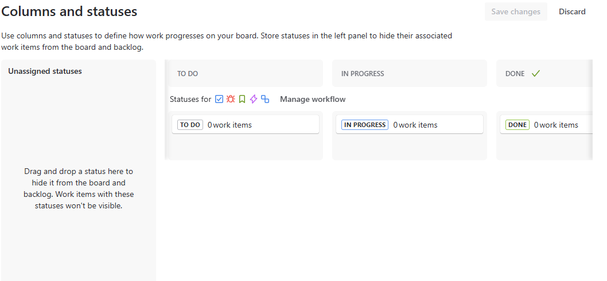
---

## 📝 **Creating Your First Issues**

### **Step 1: Create Epics**
1. **Click "Create"** in the top navigation
2. **Select "Epic"** as issue type
3. **Create these epics:**
   - **Epic 1:** Authentication System Testing
   - **Epic 2:** Waste Management Testing
   - **Epic 3:** Dashboard & Analytics Testing
   - **Epic 4:** Content Management Testing
   - **Epic 5:** Community Features Testing
   - **Epic 6:** Admin Functions Testing
   - **Epic 7:** Non-Functional Testing

### **Step 2: Create Stories**
1. **Under each Epic, create Stories:**
   - **Authentication Epic:**
     - User Registration Testing
     - User Login Testing
     - Password Validation Testing
     - Session Management Testing

   - **Waste Management Epic:**
     - Pickup Scheduling Testing
     - Request Management Testing
     - Status Tracking Testing

   - **Continue for all epics...**

### **Step 3: Create Tasks**
1. **Under each Story, create Tasks:**
   - **User Registration Testing Story:**
     - Test valid registration data
     - Test invalid email formats
     - Test password validation
     - Test duplicate email handling

### **Step 4: Create Bug Template**
1. **Click "Create"** → Select "Bug"
2. **Fill in the template:**
   - **Summary:** [Clear, concise bug title]
   - **Description:** [Brief overview of the issue]
   - **Environment:** [Browser, OS, device]
   - **Severity:** [Critical/Major/Minor/Cosmetic]
   - **Priority:** [High/Medium/Low]
   - **Steps to Reproduce:** [Numbered list]
   - **Expected vs Actual:** [Clear comparison]
   - **Attachments:** [Screenshots, videos, logs]

---

## 🔄 **Daily Jira Usage**

### **Morning Routine**
1. **Check Assigned Issues**
   - Review your assigned tasks
   - Update status of completed work
   - Plan your day's testing activities

2. **Update Progress**
   - Move tasks from "To Do" to "In Progress"
   - Add comments to ongoing work
   - Update time estimates if needed

### **During Testing**
1. **Log All Activities**
   - Create tasks for each testing session
   - Add comments with findings
   - Attach screenshots and videos

2. **Report Bugs Immediately**
   - Create bug issues as you find them
   - Use the bug template
   - Assign appropriate severity and priority

3. **Update Task Status**
   - Move completed tasks to "Done"
   - Add summary comments
   - Link related issues

### **End of Day**
1. **Review Progress**
   - Update all task statuses
   - Add daily summary comments
   - Plan next day's activities

2. **Generate Reports**
   - Check burndown charts
   - Review defect metrics
   - Update project dashboard

---

## 📊 **Jira Reports and Dashboards**

### **Creating Dashboards**
1. **Access Dashboards**
   - Click "Dashboards" in top navigation
   - Click "Create dashboard"

2. **Add Gadgets**
   - **Issue Statistics:** Shows defect counts by severity
   - **Burndown Chart:** Shows progress over time
   - **Filter Results:** Shows specific issue lists
   - **Activity Stream:** Shows recent updates

### **Useful Filters**
1. **All Bugs:**
   ```
   project = CLEANCITY AND issuetype = Bug
   ```

2. **Critical Bugs:**
   ```
   project = CLEANCITY AND issuetype = Bug AND Severity = Critical
   ```

3. **My Assigned Issues:**
   ```
   project = CLEANCITY AND assignee = currentUser()
   ```

4. **Recent Activity:**
   ```
   project = CLEANCITY AND updated >= -7d
   ```

### **Generating Reports**
1. **Go to Reports**
   - Click "Reports" in project navigation
   - Select report type

2. **Useful Reports**
   - **Velocity Chart:** Team progress over time
   - **Burndown Chart:** Sprint progress
   - **Cumulative Flow Diagram:** Work in progress
   - **Version Report:** Release progress

---

## 👥 **Team Collaboration**

### **Assigning Issues**
1. **Assign to Team Members**
   - Open any issue
   - Click "Assign to" field
   - Select team member name

2. **Add Watchers**
   - Click "Watch" on important issues
   - Get notified of updates

### **Adding Comments**
1. **Use Comments for:**
   - Progress updates
   - Additional findings
   - Questions or clarifications
   - Links to related issues

2. **Comment Best Practices**
   - Be clear and concise
   - Include relevant details
   - Use @mentions for team members
   - Add timestamps for important updates

### **Linking Issues**
1. **Link Related Issues**
   - Use "Link issue" function
   - Choose appropriate link type
   - Add description of relationship

2. **Link Types**
   - **Blocks:** One issue blocks another
   - **Relates to:** General relationship
   - **Duplicates:** Similar issues
   - **Depends on:** Dependency relationship

---

## 📋 **Jira Best Practices**

### **Issue Naming**
- **Use clear, descriptive titles**
- **Include the feature being tested**
- **Mention the specific issue type**

**Good Examples:**
- "User registration fails with invalid email format"
- "Dashboard charts not displaying on mobile devices"
- "Admin panel access control bypass vulnerability"

**Bad Examples:**
- "Bug found"
- "Something wrong"
- "Doesn't work"

### **Bug Report Quality**
1. **Clear Summary**
   - One-line description of the issue
   - Include affected feature

2. **Detailed Description**
   - What you were trying to do
   - What happened instead
   - Impact on user experience

3. **Reproduction Steps**
   - Numbered, step-by-step instructions
   - Include all necessary details
   - Test the steps yourself

4. **Environment Details**
   - Browser and version
   - Operating system
   - Device type (if mobile)

5. **Attachments**
   - Screenshots of the issue
   - Video recordings if helpful
   - Console logs if relevant

### **Progress Tracking**
1. **Regular Updates**
   - Update status daily
   - Add progress comments
   - Keep estimates current

2. **Time Logging**
   - Log time spent on issues
   - Use for future estimation
   - Track productivity

---

## 🔧 **Troubleshooting**

### **Common Issues**
1. **Can't Create Issues**
   - Check project permissions
   - Verify issue type is enabled
   - Contact project administrator

2. **Fields Missing**
   - Check custom field configuration
   - Verify field is added to screen
   - Contact project administrator

3. **Can't Assign Issues**
   - Check user permissions
   - Verify user is project member
   - Contact project administrator

### **Getting Help**
1. **Jira Help Center**
   - Visit help.atlassian.com
   - Search for specific issues
   - Use community forums

2. **Project Support**
   - Contact project manager
   - Use team communication channels
   - Check project documentation

---

## 📤 **Final Submission Requirements**

### **Jira Export**
1. **Export Project Data**
   - Go to Project Settings → Import/Export
   - Select "Export project data"
   - Include all issues and comments
   - Download XML file

2. **Generate Reports**
   - Create defect summary report
   - Generate progress charts
   - Export team activity report

3. **Include in Final Report**
   - Screenshots of Jira dashboards
   - Summary of Jira usage
   - Defect metrics and trends

### **Jira Demonstration in Video**
1. **Show Project Dashboard**
   - Overall progress view
   - Issue statistics
   - Team activity

2. **Demonstrate Bug Reports**
   - Show detailed bug entries
   - Highlight quality of documentation
   - Display attachments and comments

3. **Present Metrics**
   - Defect distribution charts
   - Progress tracking
   - Team collaboration evidence

---

# Week 1 Progress Report – Jira Setup

**Week:** 1 (24–28 June 2025)  
**Project:** CleanCity QA  
**Tool:** Jira (Team-managed project)

---

## ✅ Activities Completed

| Activity | Description | Status | Notes |
|----------|-------------|--------|-------|
| Jira Project Setup | Created project board and customized columns (To Do, In Progress, Testing, Done) | ✅ Completed | Verified on Jira dashboard |
| Team Assignments | Added members and defined roles (e.g., QA, Dev, Lead) | ✅ Completed | Each member assigned to issue types |
| Initial Test Plan | Outlined scope, objectives, and resources in markdown/Word | ✅ Completed | Uploaded separately or in test-docs folder |
| Testing Environment Setup | Verified tool installation (e.g., Zephyr, test environment URL) | ✅ Completed | Jira plugins and test spaces prepared |

---

## 🗂️ Resources Linked

- [Jira Project Board](https://testpulse2.atlassian.net/jira/software/projects/CQT/boards/2)  


---

## 📝 Summary

- Jira board created and columns customized  
- Team structure finalized  
- Initial test planning initiated (scope, objective, schedule, resources)  
- Testing environment prepared ( Xray and Zephyr plugin checked)

---

## 📎 Screenshots
- Jira board created and columns customized  


- Test Environment setup 

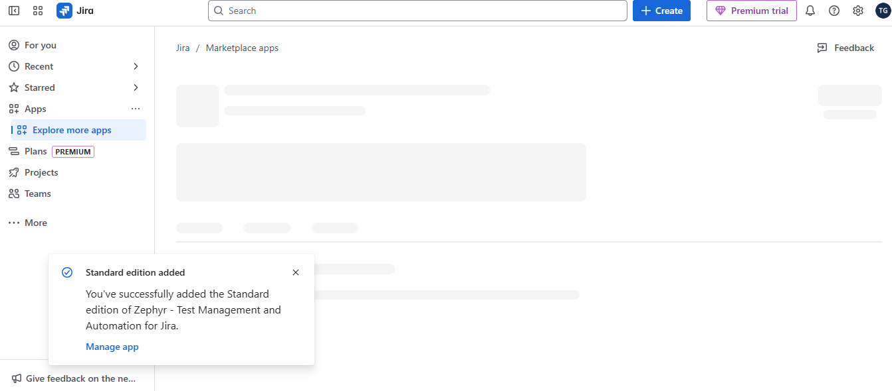

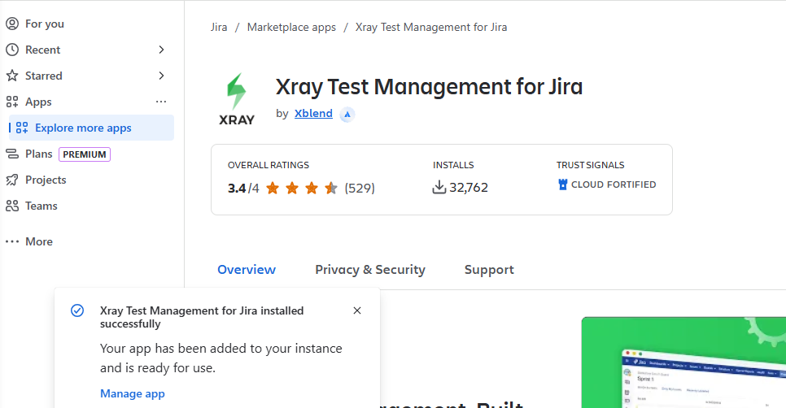

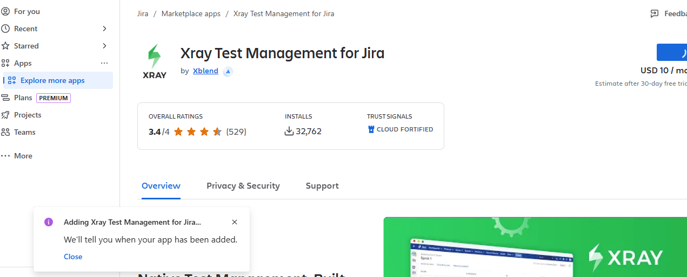

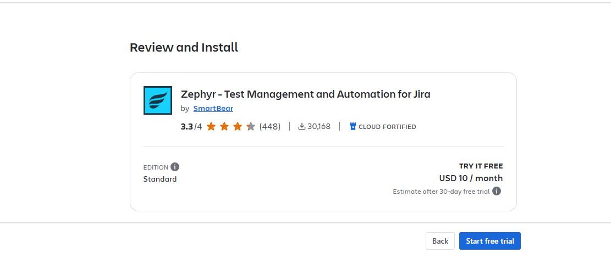

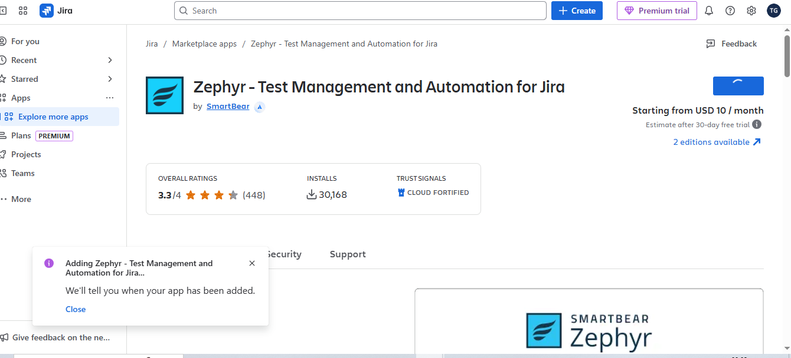

- Team assignments and roles 

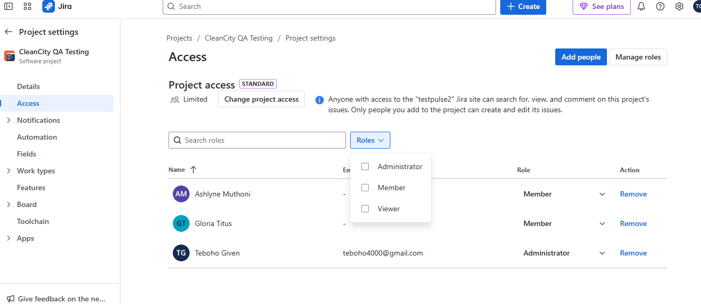

---


**Remember: Jira is your project management backbone. Use it consistently and effectively to demonstrate your professional testing approach!** 🎯✨ 